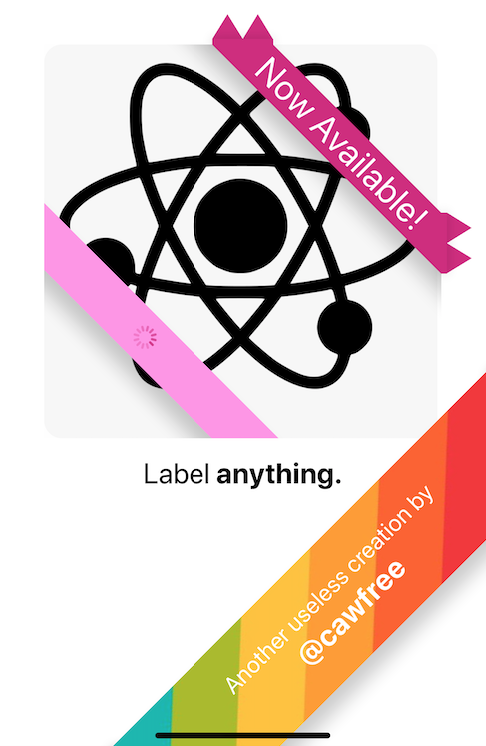
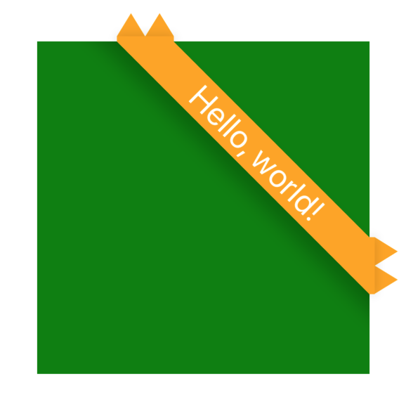

# react-native-label
🥇Apply a label to anything in React Native. Supports [**Android**](), [**iOS**]() and [**Web**]().

<p align="center">
  <a href="https://twitter.com/cawfree">
    
  </a>
</p>

## Table of Contents
  - [1. Do I need react-native-label?](#do-i-need)
  - [2. Getting Started](#getting-started)
    - [2.1 Example](#example)
  - [3. Props and Documentation](#props)
  - [4. License](#license)

## <a name="do-i-need"></a>1. 🤔 Do I need `react-native-label`?

Let's answer your question with a slightly different, much more biased set of questions:

  - Do you want fully customizable labels?
  - Do you want to embed stateful components in your labels?
  - Do you want to label your labels?
  - Do you want to label your label's labels?

If you have answered **any or none** of the above, then this repository is for _you_!

## <a name="getting-started"></a>2. 🚀 Getting Started

Using [`npm`]():

```bash
npm install --save react-native-label
```

Using [`yarn`]():

```bash
yarn add react-native-label
```

That's all.

### <a name="example"></a>2.1 ✍️ Example

A [**React Native Label**](https://github.com/cawfree/react-native-label) can be applied to any component you want. You can pass either a text `String` to the `title` prop, or provide a custom component to render. 

```javascript
import React from "react";
import {View} from "react-native";
import Label, {Orientation} from "react-native-label";

export default () => (
  <Label
    orientation={Orientation.TOP_RIGHT}
    containerStyle={{
      width: 300,
      height: 300,
    }}
    title="Hello, world!"
    color="orange"
    distance={250}
  >
    <View
      style={{
        flex: 1,
        backgroundColor: "green",
      }}
    />
  </Label>
);
```

This code yields the following result:

<p align="center">
  
</p>


Check out the complete list of available [**Prop Types**](#props) in the section below.

## <a name="props"></a>3. 📜 Props and Documentation

| Prop Name      | Type                      | Initial Value                                                                                                    | Description                                                    |
|----------------|---------------------------|------------------------------------------------------------------------------------------------------------------|----------------------------------------------------------------|
| orientation    | `Orientation`             | `Orientation.TOP_RIGHT`                                                                                          | Where to position the label over the nested view.              |
| distance       | `Number`                  | `100`                                                                                                            | How far to render the label from the corner.                   |
| containerStyle | `shape({})`               | `{flex:1}`                                                                                                             | How to style the container of the parent.                      |
| style          | `shape({})`               | `{fontSize: 30, color: 'white', textAlign: 'center', alignItems: 'center', justifyContent: 'center'}`            | How to style the label's `title`.                              |
| title          | `String \|\| ElementType` | `undefined`                                                                                                      | The label child. This is either a string or a React Component. |
| color          | `String`                  | `"#C2185B"`                                                                                                      | The color of the label.                                        |
| ratio          | `Number`                  | `0.8`                                                                                                            | The ratio of label point height to banner height.              |
| extent         | `Number`                  | `0.5`                                                                                                            | The level of stretching to apply to the label ribbons.         |
| shadowProps    | `shape({})`               | `{shadowColor: "#000", shadowOffset: { width: 0, height: 12, }, shadowOpacity: 0.2, shadowRadius: 8, elevation: 24}` | The style of the label's shadows.                              |

## <a name="license"></a>4. ✌️ License
[**MIT**](./LICENSE.md)
